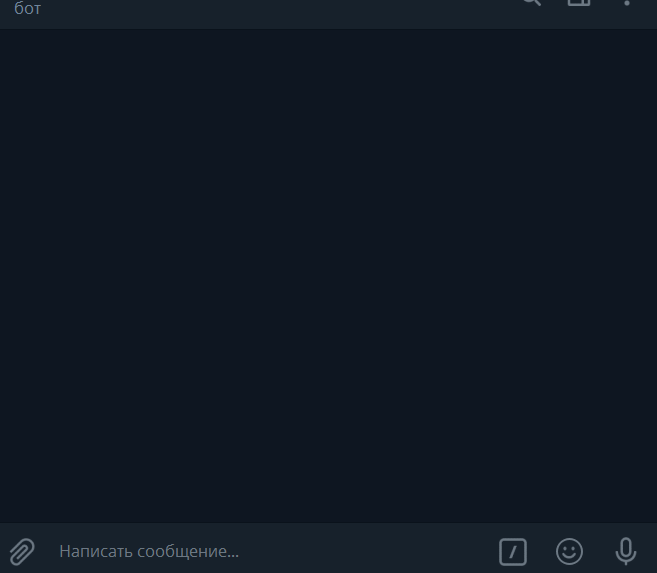

# Support conversational Bot for Telegram and VK Groups

Support conversational Bot for Telegram and VK Groups powered by Google's machine learning




### How to install

This project consists of few parts:
- Bots:
    - Support Bot for Telegram
    - Support Bot for VK Groups
    - Logging bot for Telegram
- Module to query DialogFlow API V1
- Script for loading phrases to DialogFlow AI


#### General installation requirements
Python3 should be already installed. 
It is strictly recommended that you use [virtual environment](https://docs.python.org/3/library/venv.html) for project isolation. 
Then use `pip` (or `pip3`, if there is a conflict with Python2) to install dependencies:

```bash
pip install -r requirements.txt
```
or via [pipenv](https://docs.pipenv.org/en/latest/):

```bash
pipenv install
```


It's also possible to deploy this Bot on Heroku: just create new app on Heroku and connect it with your GitHub repo after forking. 


#### Support Bot for Telegram installation requirements
You need to register Telegram Bot via [@BotFather](https://telegram.me/botfather) and receive TELEGRAM_TOKEN and TELEGRAM_CHAT_ID (use [@userinfobot](https://telegram.me/userinfobot) for that)
After that copy the file `.env-example` to `.env` and paste your info to fields:
```dotenv
TELEGRAM_TOKEN=
```

#### Support Bot for VK Groups installation requirements
For proper use you have to get VK account. You need to create a [VK Group](https://vk.com/groups_create) and create the API key for group in group settings (`https://vk.com/your_group?act=tokens`) 
Paste your info to`.env`:
```dotenv
VK_GROUP_TOKEN=your_vk_group_token
```


#### Logging Bot for Telegram installation requirements
Please see [Support Bot for Telegram installation requirements](#support-bot-for-telegram-installation-requirements).
Paste your info to`.env`:
```dotenv
TELEGRAM_LOG_TOKEN=
TELEGRAM_LOG_CHAT_ID=
```

#### Installation requirements for Google's machine learning
You have to register [DialogFlow account](https://dialogflow.com/)
After that find "Developer access token" in project settings an paste it to `.env`:
```dotenv
DIALOGFLOW_DEV_TOKEN=
```
Please note this app works only with DialogFlow V1 API (Will be shut down on October 23rd, 2019)

### Project Goals

The code is written for educational purposes on online-course for web-developers [dvmn.org](https://dvmn.org/).